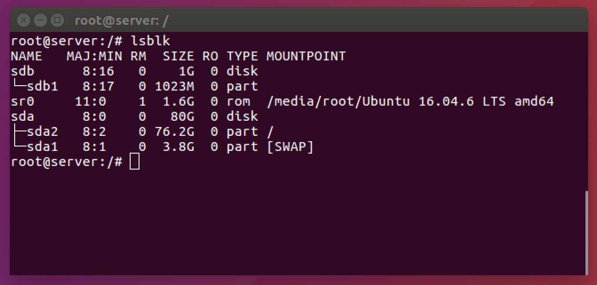

# 하드디스크 관리와 사용자별 공간 할당

sata 0(카드슬롯):0(할당넘버) - /dev/sr0

scsi 0(카드슬롯):0(할당넘버) - /dev/sda1

> 하드 디스크 추가 및 마운트 워크플로우

1. 물리적인 하드디스크 장착
2. fdisk 파티션 할당
3. mkfs 파일시스템 형성
4. mount 마운트
5. /etc/fstab에 등록

## 파티션 나누기

```bash
# 하드디스크 선택
fdisk /dev/sdb
Command : n     # 새로운 파티션 분할
Select : p     # Primary 파티션 선택
Partition number :     # 파티션 번호 1번 선택(Primary 파티션은 최대 4개까지 생성 가능)
Command : p     # 설정된 내용 확인
Command : w     # 설정 저장
```

## lsblk

드라이브 정보 나열

```bash
lsblk
```


