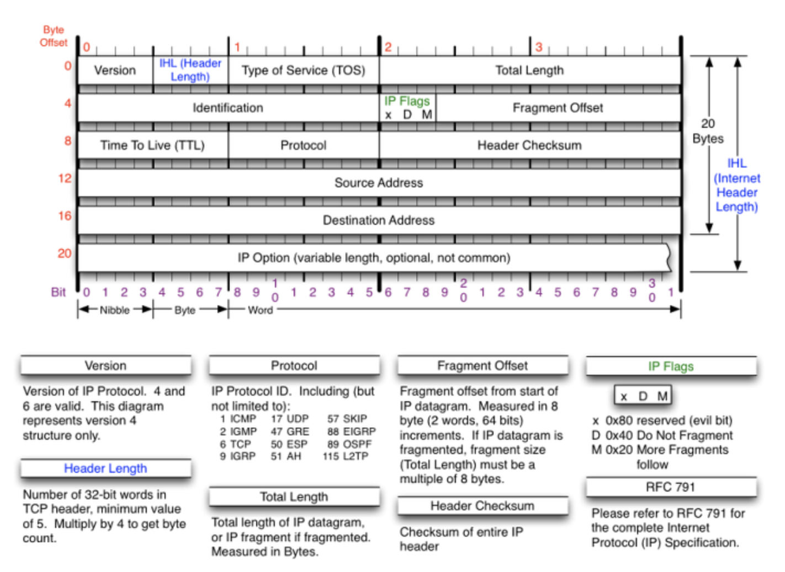

# IP Header 구조

## Version 필드 (4bit)

TCP/IP 제품은 IP v4를 사용한다.

## Header Length 필드(4bit)

IP 헤드의 길이를 32비트 단위로 나타낸다. 대부분의 IP 헤더의 길이는 20바이트 입니다. 필드 값은 거의 항상5다

(5 \* 32 = 160bit or 20Byte)

## Type-of-Service Flags

서비스의 우선 순위를 제공한다.

MTU 1500 byte

| byte | x   | D   | M   | flagment offset |
| ---- | --- | --- | --- | --------------- |
| 1400 | x   | 1   | 0   |
| 5000 |     | 0   | 1   | 0               |
|      |     | 0   | 1   | 1500            |
|      |     | 0   | 1   | 3000            |
|      |     | 0   | 0   | 4500            |

티얼드롭(Tear drop) 공격
ip 헤더의 프래그먼트 오프셋을 조작하여 수신측에서 분할된 패킷을 재조립할 수 없도록 하는 공격 기법

## Total Packet Length 필드 (16bit)

전체 IP 패킷의 길이를 바이트 단위로 나타낸다.

## Fragment identifier 필드 (16bit)

분열이 발생한 경우, 조각을 다시 결합하기 원래의 데이터를 식별하기 위해서 사용한다.

## Fragmentation Flags 필드 (3bit)

처음 1bit는은 항상 0으로 설정, 나머지 2비트의 용도는 다음과 같다.

- May Fragment : IP 라우터에 의해 분열되는 여부를 나타낸다. 플래그 0 - 분열 가능 1 - 분열 방지

- More Fragments : 원래 데이터의 분열된 조각이 더 있는지 여부 판단.

  플래그 0 - 마지막 조각, 기본값 1- 조각이 더 있음

## Fragmentation Offset 필드 (13bit)

8바이트 오프셋으로 조각에 저장된 원래 데이터의 바이트 범위를 나타낸다.
