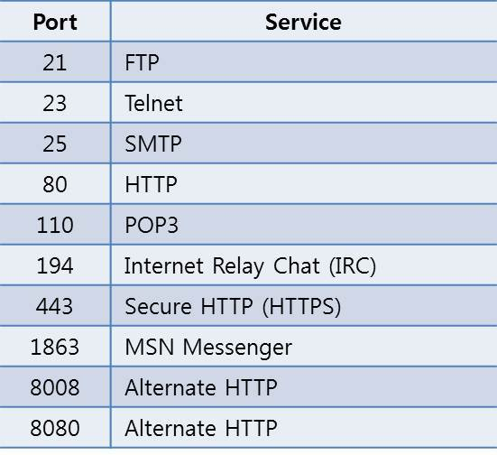
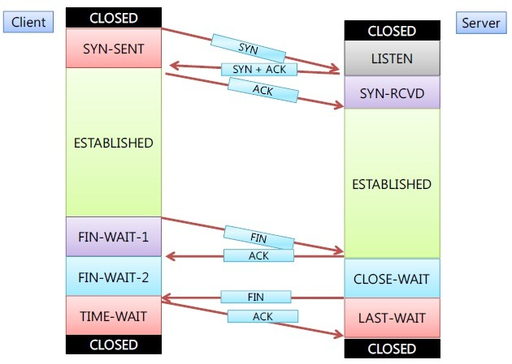

# TCP

<https://www.gatevidyalay.com/transmission-control-protocol-tcp-header/>

<https://mindnet.tistory.com/entry/%EB%84%A4%ED%8A%B8%EC%9B%8C%ED%81%AC-%EC%89%BD%EA%B2%8C-%EC%9D%B4%ED%95%B4%ED%95%98%EA%B8%B0-19%ED%8E%B8-TCP-Header-4%EA%B3%84%EC%B8%B5-TCP-%ED%97%A4%EB%8D%94-%EA%B5%AC%EC%A1%B0>

TCP Header

## Source Port address 필드(16bit)

데이터를 생성한 애플리케이션에서 사용하는 포트번호를 나타낸다.

- Well-known ports(0~1,023) : IANA에 의해 배정되고 제어된다.

- Registered port(1,024~49,151) : IANA에 의해 배정되거나 제어되지 않는다. 하지만 중복을 피하기 위해 IANA에 등록 될 수는 있다.

- Dynamic Ports(49,152~65,535) : IANA에 의해 제어되거나 등록되지 않는다. 어느 프로세스라도 사용 할 수 있으며 임시 포트이다.

클라이언트를 위한 임시 포트 번호는 이 영역에서 선택되도록 권고되고 있다.

## Destination Port address 필드(16bit)

목적지 애플리케이션이 사용하는 포트 번호

## Sequence number 필드(32bit)

전송되는 데이터의 가상 회선을 통해 전송되는 데이터의 모든 바이트에는 고유한 일련 번호가 부여된다.

네트워크가 불안하여 패킷을 분실, 지연 등으로 세그먼트가 순서가 어긋나게 도착 할 수 있기 때문에 sequence number를 이용하여 데이터를 올바른 순서로 재배열할 수 있다.

## Acknowledgement number 필드(32bit)

다음 세그먼트를 수신할 준비가 되었다는 사실을 알린다.

모든 데이터가 수신되었다는 것을 나타내는 묵시적인 확인 메시지 역할을 한다.

## Header Length 필드 (4bit)

헤드의 길이를 32비트 단위로 나타낸다. 최소 필드 값은 5 (5 \* 32 = 160bit or 20Byte )

최대 값 15 (15 \* 32 = 480bit or 60byte)

## Reserved 필드(6bit)

차후의 사용을 위해서 예약된 6 비트 필드이다.

## Control Flags 필드(6bit)

6개의 서로 다른 제어 비트 또는 플래그를 나타낸다. 동시에 여러 개의 비트가 1로 설정될 수 있다.

**CWR** : Congestion Window Reduced) – 혼잡 윈도우 크기 감소

**ECN** : Explicit Congestion Notification) – 혼잡을 알림

**URG(Urgent)** : Urgent Pointer 필드가 가리키는 세그먼트 번호까지 긴급 데이터를 포함되어 있다는 것을 뜻한다.

이 플래그가 설정되지 않았다면 Uregent Pointer 필드는 무시되어야 한다.

**ACK(Acknowledgment)** : 확인 응답 메시지

**PSH(Push)** : 데이터를 포함한다는 것을 뜻한다.

**RST(Reset)** : 수신 거부를 하고자 할때 사용

**SYN(Synchronize)** : 가상 회선이 처음 개설될 때 두 시스템의 TCP 소프트웨어는 의미 있는 확인 메시지를 전송하기 위해 일련 번호를서로 동기화해야 한다.

**FIN(Finish)** : 작업이 끝나고 가상 회선을 종결하고자 할 때 사용

## Window size 필드(16bit)

송신 시스템의 가용 수신 버퍼의 크기를 바이트 단위로 나타낸다.

## Checksum 필드(16bit)

TCP 세그먼트의 내용이 유효한지 검증하고 손상 여부를 검사 할 수 있다.

## HTTP

- request, response
- stateless

## Request

3way handshake
Client | State | Server
---------|----------|---------
|| syn -> | |
| | <- syn / ark | |
|| ark -> |

## Response

4way handshake
Client | State | Server
---------|----------|---------
|| fin -> | |
| | <- fin / ark | |
|| <- fin |
|| fin / ark -> |

## TCP Flags

F : Final

MTU 1500 byte

| byte | x   | D   | M   | flagment offset |
| ---- | --- | --- | --- | --------------- |
| 1400 | x   | 1   | 0   |
| 5000 |     | 0   | 1   | 0               |
|      |     | 0   | 1   | 1500            |
|      |     | 0   | 1   | 3000            |
|      |     | 0   | 0   | 4500            |

티얼드롭(Tear drop) 공격
ip 헤더의 프래그먼트 오프셋을 조작하여 수신측에서 분할된 패킷을 재조립할 수 없도록 하는 공격 기법
