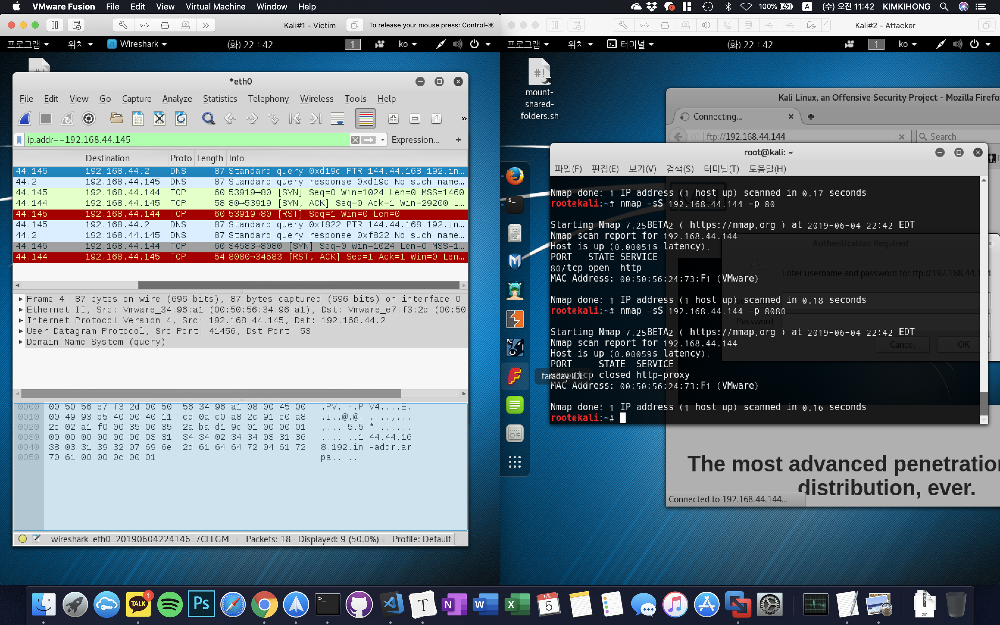
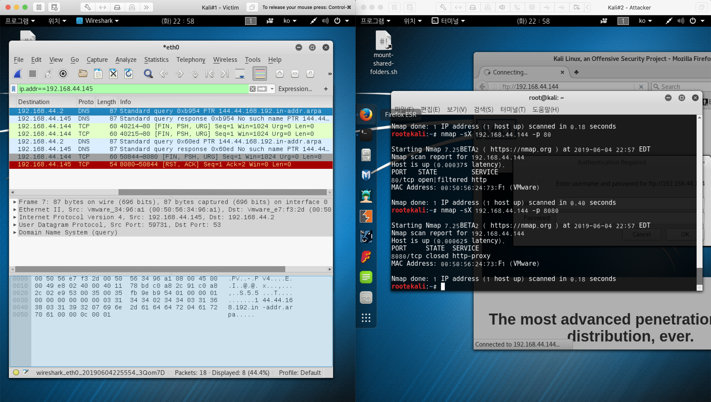

# nmap(network map)

네트워크에 연결되어 있는 호스트의 정보를 파악하는 도구  
nmap을 이용해서 네트워크에 연결되어 있는 호스트의 IP, OS, Service Port, SW 등을 확인할 수 있음

```bash
nmap --help
SCAN TECHNIQUES:
# 소문자 s = scan 대문자는 유형
  -sS/sT/sA/sW/sM: TCP SYN/Connect()/ACK/Window/Maimon scans
  -sU: UDP Scan
  -sN/sF/sX: TCP Null, FIN, and Xmas scans
  --scanflags <flags>: Customize TCP scan flags
  -sI <zombie host[:probeport]>: Idle scan
  -sY/sZ: SCTP INIT/COOKIE-ECHO scans
  -sO: IP protocol scan
  -b <FTP relay host>: FTP bounce scan
```

## TCP Open Scan


TCP 연결 과정 : 3way handshaking을 통해서 해당 포트의 실행(사용)여부를 확인  
해당 포트가 유효하면 : SYN -> SYN/ARC -> ACK = 연결이 수립 -> 접속(연결) 로그가 남음
해당 포트가 무효하면 : SYN -> RST/ARC

## TCP Half open scan



해당 포트가 유효하면 : SYN -> SYN/ACK -> ACK보내지 말고 가만히 있음 (혹은 RST를 보냄) -> 연결이 수립되지 않았기 때문에 로그가 남지 않는다
해당 포트가 무효하면 : SYN -> RST/ARC

## FIN Scan


해당 포트가 유효하면 : FIN -> ????(무응답)
해당 포트가 무효하면 : SYN -> RST/ACK

## Xmas Scan



해당 포트가 유효하면 : FIN+PSH+URG -> ????(무응답)
해당 포트가 무효하면 : FIN+PSH+URG -> RST/ACK

## Null Scan


해당 포트가 유효하면 : Null(flag 없이 보냄) -> ????(무응답)
해당 포트가 무효하면 : Null -> RST/ACK

ex) 지정된 포트 ip 211.235.180._ 으로 지정해서 검색  
nmap -p 22.23.80.443 211.235.180._

절대 하면 안된다. 해킹이고 불법  
정보통신망법에 걸려서 징역을 산다
