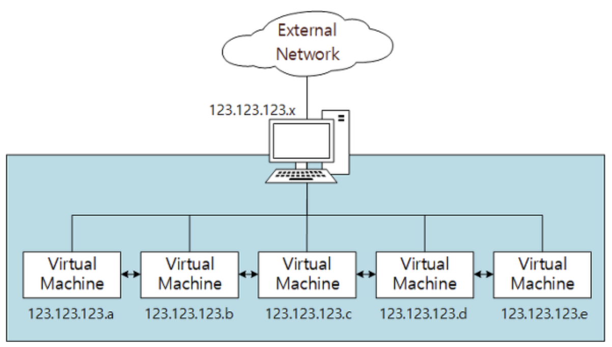
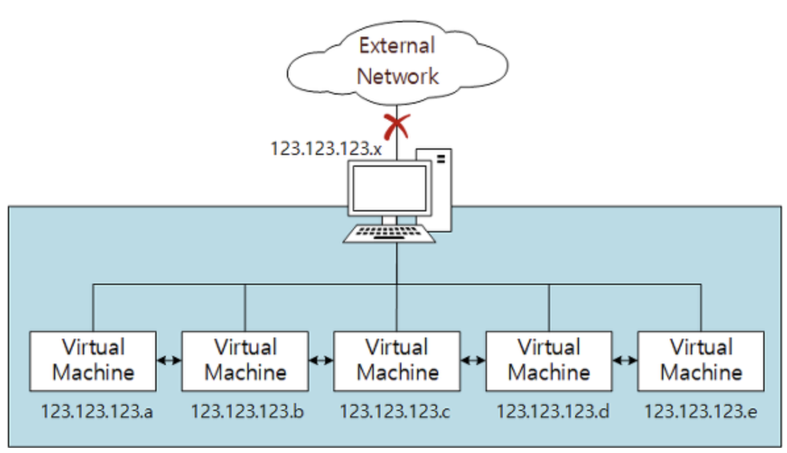

# 네트워크 컴퓨터 간 통신

## NAT(Network Address Translation)

NAT(Network Address Translation)

## NAT Network

NAT Network 방식

## Bridged Adapter

Bridged Adapter

## Internal Network

Internal Network

## Host-Only Adapter

Host-Only Adapter

## Generic Driver

- 거의 사용하지 않음

- UDP Tunnel networking, VDE(Virtual Distributed Ethernet) 지원
