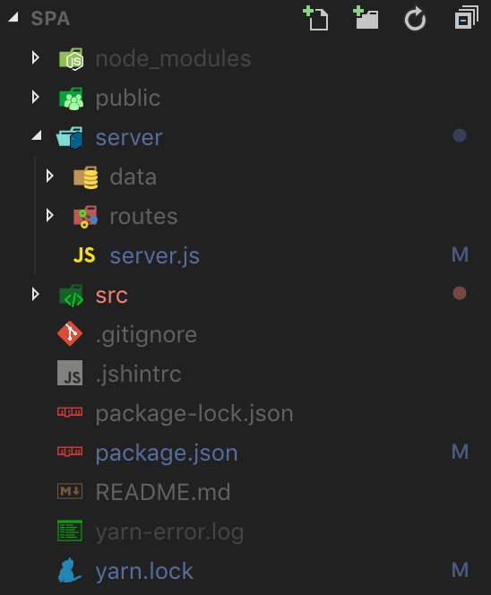

## path tree


리액트 아래에 server 디렉터리에 backend 서버 구축

## package module 설치

<https://www.npmjs.com/package/npm-run-all>

```bash
yarn add npm-run-all
```

## package.json 수정

```json
"scripts": {
    "start": "npm-run-all --parallel start:**",
    "start:client": "react-scripts start",
    "start:server": "cd server && node server.js",
    "build": "react-scripts build",
    "test": "react-scripts test",
    "eject": "react-scripts eject"
  }
```
