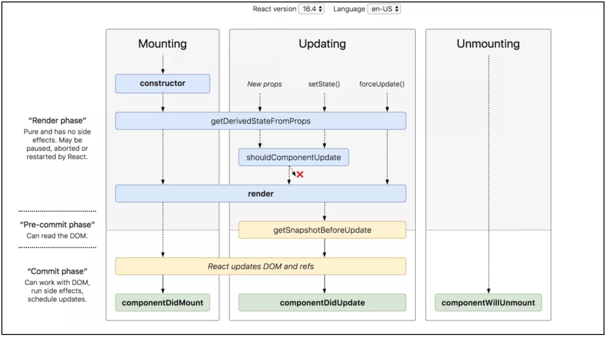

# 컴포넌트 생명주기

## 초기 렌더링 단계

- Props 초기화
- State 초기화
- componentWillMount()
- render()
- componentDidMount()
  - 컴포넌트 렌더링 후 데이터 호출 시

## 업데이트 단계

- shouldComponentUpdate()
  - 컴포넌트를 업데이트 할 지 말지 결정
  - False를 리턴하면 업데이트 스킵
- componentWillUpdate()
- render()
- componentDidUpdate()

## 언마운트 단계

- componentWillUnmount()
