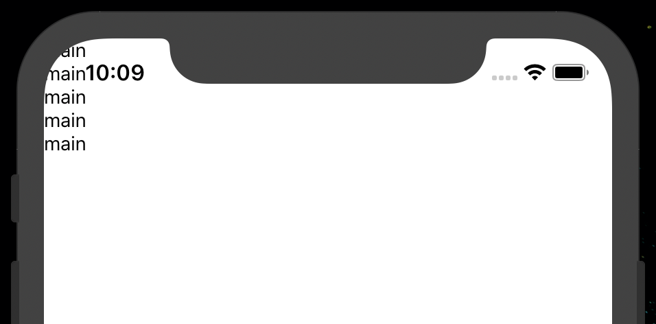

# SafeAreaView 컴포넌트

아이폰x 이후 노치 스타일 혹은 펀치홀 디스플레이에서 안보이는 영역으로 컴포넌트가 랜더링되지 않도록 해주는 것

```js
<View>
  <Text>main</Text>
  <Text>main</Text>
  <Text>main</Text>
  <Text>main</Text>
  <Text>main</Text>
</View>
```

View 컴포넌트는 아래와 같이 랜더링이 된다



```js
<SafeAreaView>
  <Text>main</Text>
  <Text>main</Text>
  <Text>main</Text>
  <Text>main</Text>
  <Text>main</Text>
</SafeAreaView>
```

SafeAreaView 컴포넌트는 아래와 같이 랜더링이 된다


