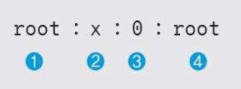

# 리눅스 계정 관리

## 계정 목록 확인

/etc/passwd 파일에서 계정 목록 확인

```bash
cat /etc/passwd
```


❶ 사용자 계정.  
❷ 패스워드가 암호화되어 shadow 파일에 저장되어 있음을 나타냄.  
❸ 사용자 번호. (0 이면 root 권한)  
❹ 그룹 번호. (0 이면 root 권한)  
❺ 실제 이름으로, 시스템 설정에 영향을 주지 않으므로 자신의 이름을 입력해도 됨.  
❻ 사용자의 홈 디렉터리 설정으로, 이 예에서는 관리자 계정이므로 홈 디렉터리가 /root. 일반 사용자는 /home/wishfree와 같이 /home 디렉터리의 하위에 위치.  
❼ 사용자의 셸 정의로 기본 설정은 bash 셸. 사용하는 셸을 이곳에 정의.

## 암호 저장 파일 확인

실제 암호는
`/etc/shadow` 에 해쉬로 담겨있음

```bash
cat /etc/shadow
```

## 계정 리스트만 뽑아 보기

```bash
cut -f1 -d: /etc/passwd
```

## uid 500 이상인 계정만 뽑아 보기

```bash
awk -F':' '{if($3>=500)print $1}' /etc/passwd
```

## 사용자 계정 개수 확인하기

```bash
cat /etc/passwd | wc -l
```

## uid 500 이상인 계정 개수 확인하기

```bash
awk -F':' '{if($3>=500)print $1}' /etc/passwd | wc -l
```

## 계정 추가

```bash
sudo adduser newuser
# or
sudo useradd newuser
```

## 계정 삭제

```bash
sudo deluser --remove newuser
# or
sudo userdel --remove newuser
```

## 계정 변경

```bash
# su = switch user
su username
```

## 그룹 확인

```bash
cat /etc/group
cut -f1 -d: /etc/group
```

## 그룹 파일 구조



❶ 그룹 이름으로, 여기서는 root 그룹을 말함.  
❷ 그룹에 대한 패스워드로, 일반적으로는 사용하지 않음.  
❸ 그룹 번호로, 0은 root 그룹.  
❹ 해당 그룹에 속한 계정 목록.

## 그룹 추가

### groupadd

> 기능  
> 그룹을 생성한다
>
> 형식  
> groupadd [option] groupname
>
> 옵션  
> -g gid : 그룹의 GID를 지정  
> -o : GID의 중복을 허용

```bash
# 옵션이 없으면 GID를 가장 마지막 번호의 다음 번호로 자동 설정
groupadd newgroup
addgroup newgroup1

# GID 지정하여 그룹 생성
groupadd -g 1234 newgroup2

# GID 중복 지정
groupadd -g 1234 -o newgroup3

# -r
groupadd -r newgroup4

# --system
addgroup --system newgroup5
```

## 그룹 확인

```bash
cat /etc/group
```

## 그룹 패스워드 파일 확인

```bash
cat /etc/gshadow
```

## 그룹 삭제

```bash
groupdel newgroup
delgroup newgroup
```

## 계정 추가시 기본 파일 복사

/etc/skel 폴더에 파일을 넣어두면 계정 생성시 홈 디렉토리로 복사

## 중복된 root 계정 존재 여부 확인

```bash
grep ‘:0:’ /etc/passwd
```
