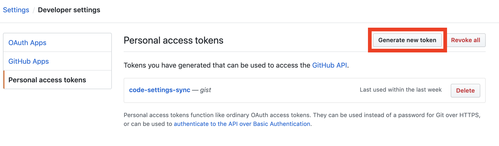
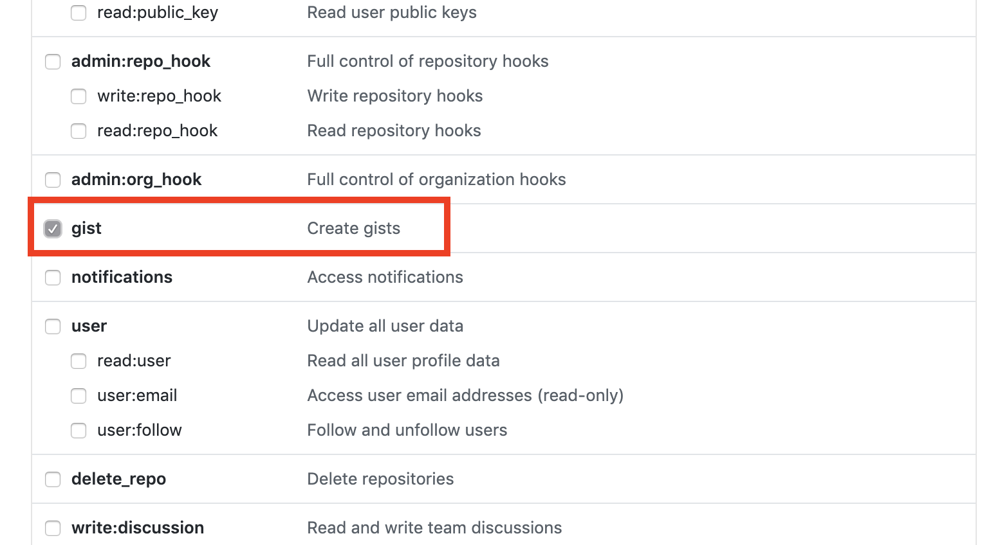
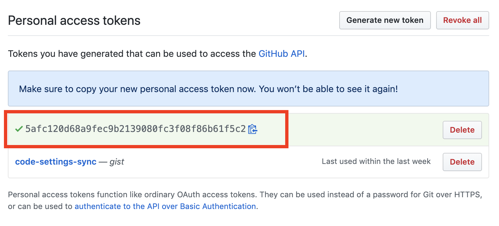

## Settings Sync

<https://marketplace.visualstudio.com/items?itemName=Shan.code-settings-sync>

## Extention Setup

Extentions(ctl+cmd+x) -> code-setting-sync

## Get the Github Personal Access Token

GitHub 계정의 Personal Access Token을 이용해서 gist를 업로드, 다운로드하여 동기화하기 위해 토큰을 생성

GitHub 계정 로그인 > Settings > Developer settings> Personal Access Tokens > Generate New Token

토큰 사용 용도로 gist를 체크

생성된 토큰은 복사해서 보관

## Upload Settings

Shift + Alt + U

Output에 Gist Id가 생성된다

CODE SETTINGS SYNC UPLOAD SUMMARY  
Version: 3.2.9

GitHub Token: ~~~  
GitHub Gist: ~~~  
GitHub Gist Type: Secret

## Download settings to other devices

Shift + Alt + D
