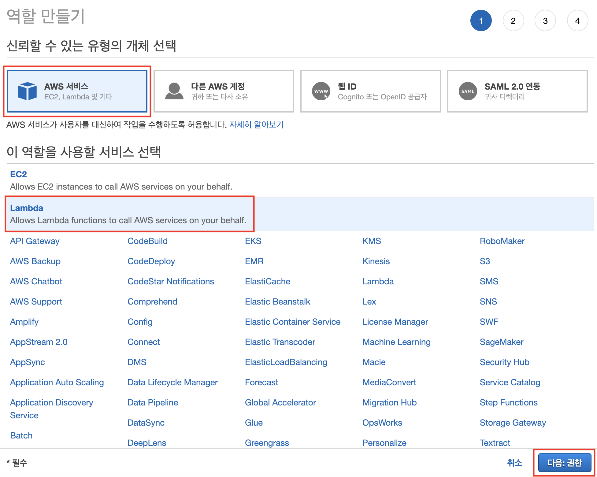
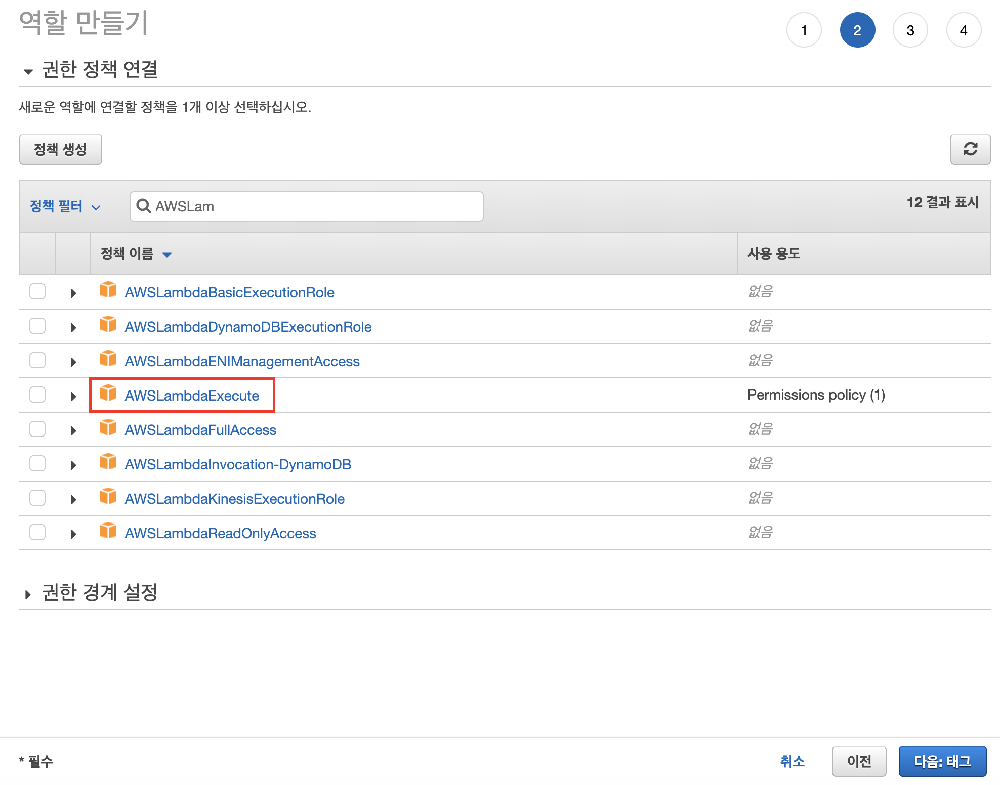
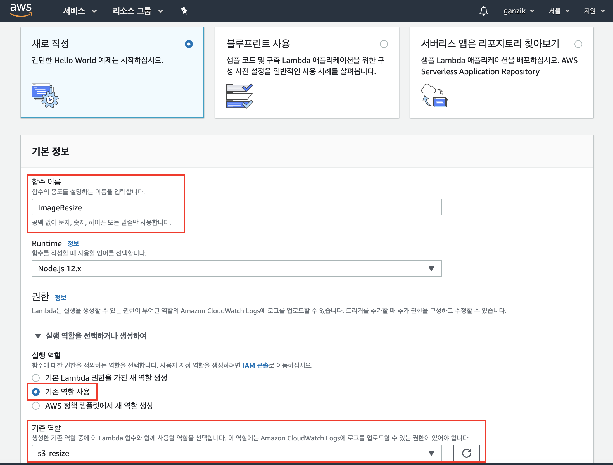
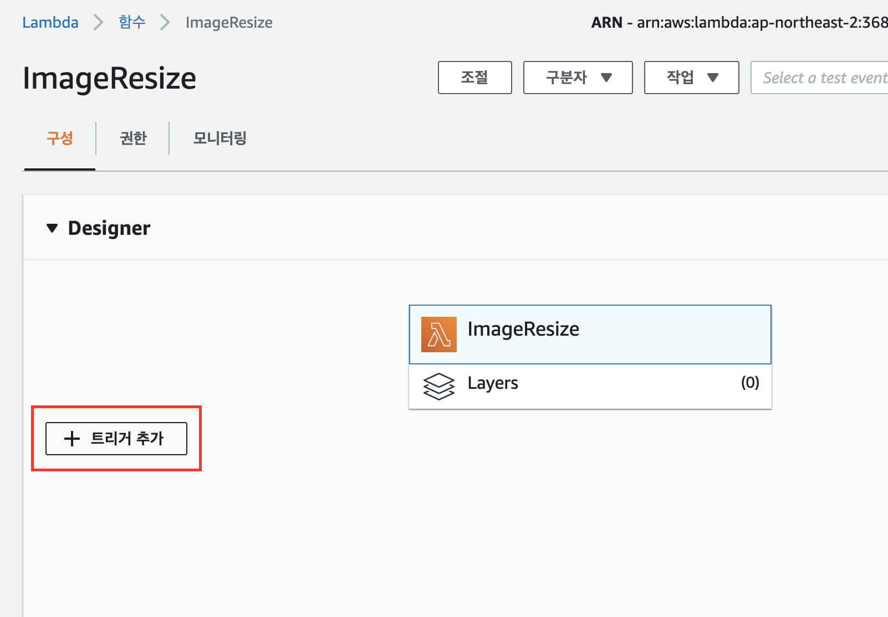
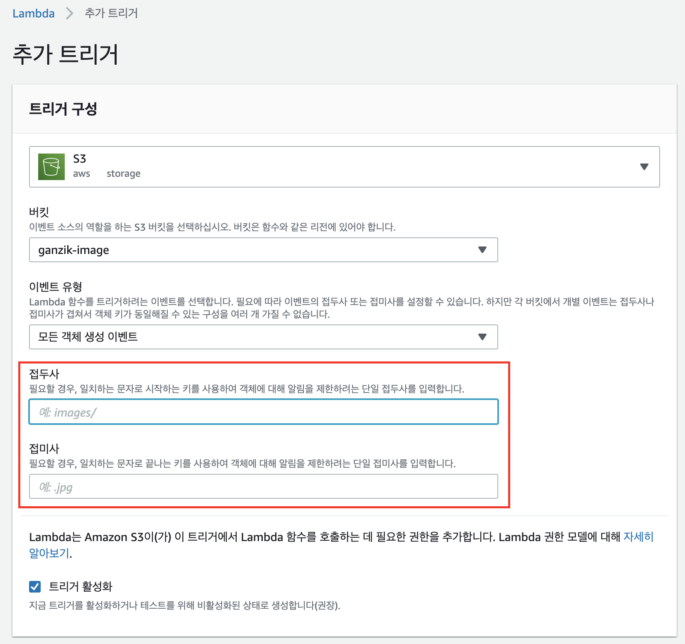

# s3 lambda 리사이즈

<https://levelup.gitconnected.com/resize-an-image-in-aws-s3-using-lambda-function-dc386afd4128>

<https://heropy.blog/2019/07/21/resizing-images-cloudfrount-lambda/>

## 1. 역할 생성







## 2. 리사이즈 함수 생성

sharp 모듈 설치를 리눅스에서 해야한다.
aws cloud9 혹은 vmware 리눅스 우분투 이미지에서 작업하자

프로젝트 디렉토리를 생성하고 index.js 파일을 작성

```js
```

모듈 설치

```sh
yarn add sharp
```

압축

```sh
# imageResize.zip 으로 디렉토리 모든 파일을 압축
zip -r imageResize.zip .
```

## 3. lambda 함수 생성

서비스 -> lambda -> 함수 -> 함수생성







중요사항!!
트리거 접두사를 잘 지정해야한다
그렇지 않으면 무한반복 실행이 된다. 새로운 이미지를 생성하면 리사이즈된 이미지가 생성되는것도 트리거가 되기 때문에 무한반복 실행
따라서 오리지널 이미지가 존재하는 디렉토리를 제대로 입력해줘야한다
