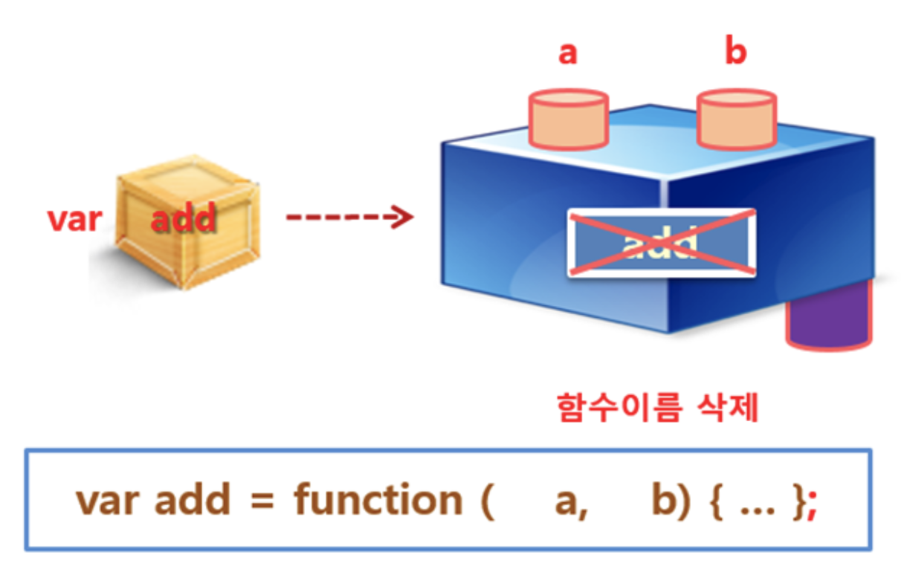

# 노드 자바스크립트

- 클라이언트가 아닌 서버에서 스크립트 코드가 실행
- 브라우저에서 실행되는 것이 아니기 때문에 BOM 객체가 제공되지 않음(window, navigator, screen, document 등)
- 대신 global 객체, 내장 모듈 및 확장 모듈 이용 가능

## 노드 JavaScript 기본 문법

### 변수 선언 및 대입

```js
// 변수 선언
var name = "홍길동";
var age = 30;

console.log(name);
console.log(age);
```

### 객체 선언 및 대입

```js
// 객체 선언
var User = {};
User["age"] = 20;
User["name"] = "심청이";
User.phoneNumber = "010-1234-5678";

//객체 사용
console.log("이름 : %s", User.name);
console.log("나이 : %n", User.age);
console.log("전화번호 : %s", User.phoneNumber);
```

## 함수


익명함수

- 이름 없는 함수
- 함수가 변수에 대입되거나, 다른 함수의 인자로 쓰이는 경우 자기 이름이 없는 익명 함수로 정의해서 사용 가능

```js
function(){

};
```



```js
function add(a, b) {
  return a + b;
}

var result = add(10, 10);
console.log("더하기 (10, 10) : %d", result);

// 익명 함수를 변수에 집어 넣는다
var subtract = function(a, b) {
  return a - b;
};

console.log(result);
console.log("");
// 변수 이름으로 함수를 실행 시킬 수 있다
console.log(subtract(10, 10));
```

### 콜백 함수

```js
function add(a, b, callback) {
  var result = a + b;
  callback(result);
}

add(10, 20, function(result) {
  console.log("콜백함수 호출됨");
  console.log("result = " + result);
});
```

```js
function add(a, b, callback) {
  var result = a + b;
  callback(result);
}

function callback2(result) {
  console.log("콜백함수 호출됨");
  console.log("result = " + result);
}

add(10, 20, callback2);
```

강사용

```js
function add(a, b, callback) {
   console.log("--> add함수");
   var result = a + b;
   for(let i=0; i<1000000; i++) {
       for(let j=0; j<1000; j++) {

       };


   callback(result);
   console.log("<-- add함수");
}

console.log('--> add함수 호출');
add(10, 20, function(result) {
   console.log('--> callback() ');
   console.log('result = ' + result);
   console.log('<-- callback');
});
console.log('<-- add함수 호출');
```

비동기 콜백 처리 이해  
<http://latentflip.com/loupe/?code=JC5vbignYnV0dG9uJywgJ2NsaWNrJywgZnVuY3Rpb24gb25DbGljaygpIHsKICAgIHNldFRpbWVvdXQoZnVuY3Rpb24gdGltZXIoKSB7CiAgICAgICAgY29uc29sZS5sb2coJ1lvdSBjbGlja2VkIHRoZSBidXR0b24hJyk7ICAgIAogICAgfSwgMjAwMCk7Cn0pOwoKY29uc29sZS5sb2coIkhpISIpOwoKc2V0VGltZW91dChmdW5jdGlvbiB0aW1lb3V0KCkgewogICAgY29uc29sZS5sb2coIkNsaWNrIHRoZSBidXR0b24hIik7Cn0sIDUwMDApOwoKY29uc29sZS5sb2coIldlbGNvbWUgdG8gbG91cGUuIik7!!!PGJ1dHRvbj5DbGljayBtZSE8L2J1dHRvbj4%3D>

### 배열 사용

```js
var score = [10, 40, 30, 20];

for (let i in score) {
  var out = "";
  out = score[i] + " : ";
  for (let j = 0; j < score[i]; j++) {
    out = out + "*";
  }
  console.log(out);
}
```

### 객체 초기화

```js
var Car = {};

Car.name = "Sorento";
Car.cc = 2000;
Car.number = "11주 1111";
Car.owner = "홍길동";

Car.changeOwner = function(newOwner) {
  this.owner = newOwner;
};

console.log(Car);
Car.changeOwner("임꺽정");
console.dir(Car);
```

```js
var Car = {
   name : 'Sorento',
   cc : 2000,
   number : '11주 1111',
   owner : '홍길동',
   changeOwner : function (newOwner) {
       this.owner = newOwner;

}

console.log(Car);
Car.changeOwner('임꺽정');
console.dir(Car);
```

## ES6(ES2015++)

브라우저별 지원 현황 <http://kangax.github.io/compat-table/es5>

- var : 기존 JavaScript 에서 사용, 함수 스코프
- let : ES6 이후 JavaScript 에서 권장. 블록 스코프
- const : ES6 이후 JavaScript 에서 상수 정의에 사용, 블록 스코프

### 템플릿 문자열

- ES6 부터 사용된 새로운 문자열 표기 방식.
- 문자열 표현 시 내부에 변수 및 개행문자, 공백, 탭 등을 그대로 사용 가능

```js
// ES5
num3 + ‘ 더하기 ‘ + num4 + ‘ 는 ‘ + result;

// ES6
`${num3} 더하기 ${num4}는 ${result} `;
```

```js
var num1 = 1;
var num2 = 2;
var result = num1 + num2;
var string1 = num1 + " 더하기 " + num2 + "는 '" + result + "'";
var string2 = `${num1} 더하기 ${num2}는 '${result}'`;

console.log(string1);
console.log(string2);
```

### 객체 리터럴 관련

기존 방식

```js
var sayNode = function() {
  console.log("Node");
};
var es = "ES";
var oldObject = {
  sayJS: function() {
    console.log("JS");
  },
  sayNode: sayNode
};
oldObject[es + 6] = "Fantastic";

oldObject.sayNode();
oldObject.sayJS();
console.log(oldObject.ES6);
```

개선 방식

- 내부 함수 정의 시 function 키워드 필요 없음
- Key와 value가 같은 이름인 경우 key만 적어도 됨
- 동적으로 key 생성
- 전체적으로 코딩이 짧아짐

```js
var sayNode = function() {
  console.log("Node");
};
var es = "ES";
const newObject = {
  sayJS() {
    // define function
    console.log("JS");
  },
  sayNode, // key=value
  [es + 6]: "Fantastic" // dynamic key
};
newObject.sayNode(); // Node
newObject.sayJS(); // JS
console.log(newObject.ES6);
```

### 화살표 함수

- 화살표 방식의 함수 선언 추가됨
- 기존 function 키워드 대신 ‘=>’ 화살표 사용
- 간단한 리턴문의 경우 {, }, return 없이 사용 가능

```js
( ) => { … }   	           // 매개변수가 없는 경우
 x => { … } 		// 매개변수가 하나인경우 ( ) 생략 가능
 (x, y) => { … }	           // 매개변수가 여러 개인 경우 , 사용, ( ) 생략 불가
 x => (x * x)		// 함수 몸체가 return 문인 경우 축약 가능
```

```js
function add1(x, y) {
  return x + y;
}
const add2 = (x, y) => {
  return x + y;
};
const add3 = (x, y) => x + y;
```

### 비구조화 할당

- 구조 분해 할당(destructuring assignment)라고도 함
- 배열이나 객체의 속성 값을 변수에 꺼내 올 때 사용

배열의 비구조화 할당

```js
// 배열의 구조 분해
var foo = ["one", "two", "three"];
var [one, two, three] = foo;

console.log(one); // "one"
console.log(two); // "two"
console.log(three); // "three"
```

나머지 할당

```js
// 나머지 할당
var [a, b, ...c] = [1, 2, 3, 4, 5];

console.log(a); // 1
console.log(b); // 2;
console.log(c); // [3, 4, 5];
```

리턴값 비구조화 할당

```js
// 함수 반환값 분해
function f() {
  return [1, 2];
}

var a, b;

[a, b] = f();
console.log(a); // 1
console.log(b); // 2
```

객체의 비구조화 할당

```js
var o = { p: 42, q: true };
var { p, q } = o;

console.log(p); // 42
console.log(q); // true

var a, b;

({ a, b } = { a: 1, b: 2 });
console.log(a);
console.log(b);
```

다른 이름의 변수로 할당

```js
var o = { p: 42, q: true };
var { p: foo, q: bar } = o;

console.log(foo); // 42
console.log(bar); // true
```

---

%d : 숫자열로 출력
%s : 문자열로 출력
%j : 객체를 json 형식으로 출력
