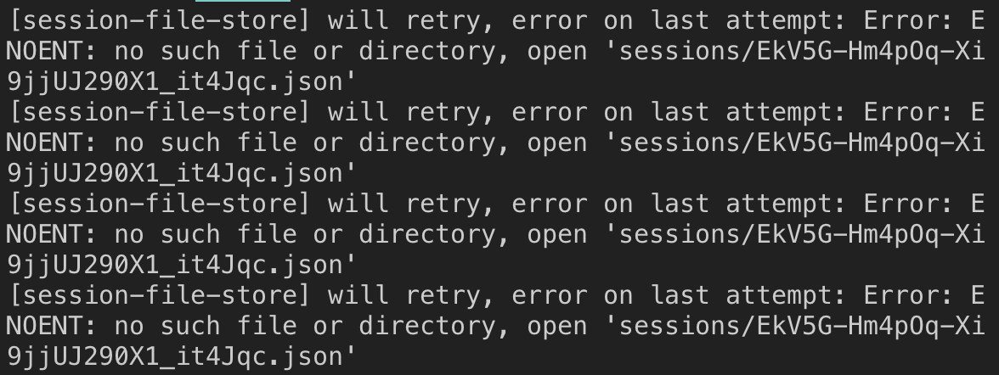

# [session-file-store] will retry, error on last attempt: Error: ENOENT: no such file or directory, open 'sessions/~~~~~~~~' 에러

[session-file-store] will retry, error on last attempt: Error: ENOENT: no such file or directory, open 'sessions/EkV5G-Hm4pOq-Xi9jjUJ290X1_it4Jqc.json'



세션 생성 할 때 위와 같은 에러를 발생하면 권한과 관련이 있다

sessions 디렉터리 권한 설정을 해준다

```bash
chmod +x sessions
```
