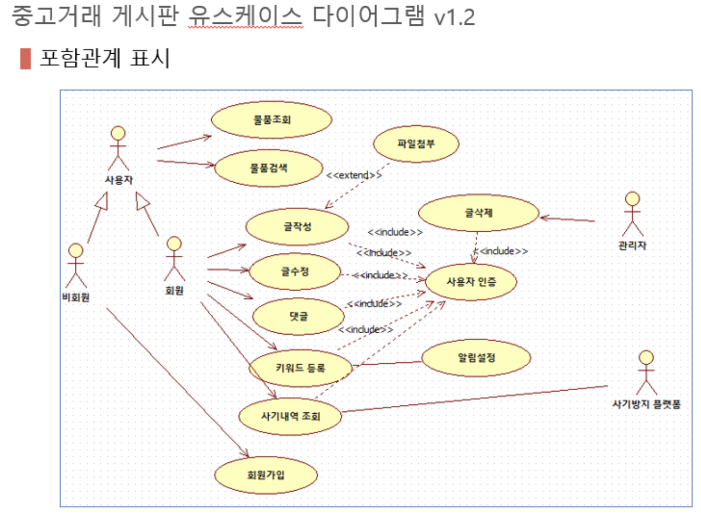
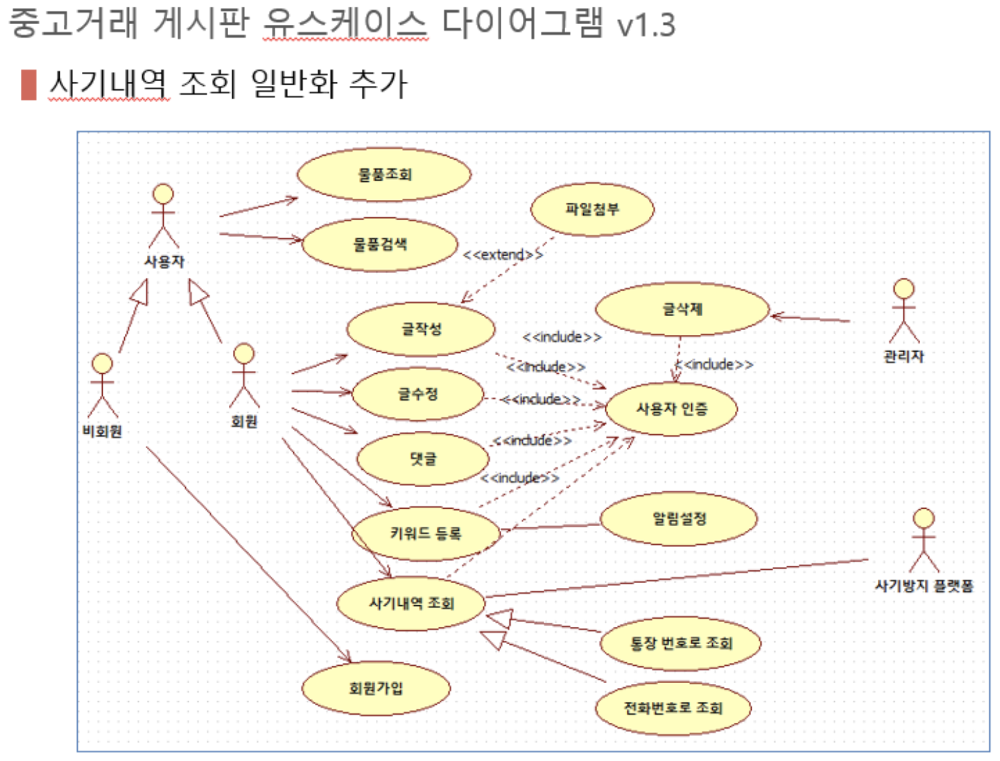

# Use Case 분석

## Use Case Diagram

usecase란 말 그대로 컴퓨터 시스템과 사용자가 상호작용을 하는 하나의 경우이다. 예를 들어 운동등록 프로그램의 경우 "고객이 헬스장계약서에 사인한다" "헬스트레이너가 등록 통계량을 종합한다." 등이 usecase가 된다. 이러한 유즈케이스 다이어그램은 **시스템 구축의 초기에 이 시스템이 어떠한 일을 하는지에 대한 부분을 사용자 입장에서 이해할수 있을 정도로 기술을 해야한다.** 이러한 유즈케이스 다이어그램은 사용자와의 대화수단으로 그리고 앞으로 구축해 나갈 때의 밑바탕이 되는 것이다.

## Use Case Diagram 구성요소

- Actor
  - 시스템 외부 존재하며 시스템과 상호작용하는 것
  - 이벤트를 발생시키는 주체
  - 사람 / 외부 시스템 / HW 장치 / 이벤트
- Use Case
  - 사용자에게 의미 있는 결과를 전달하는 시스템상의 행동 그룹
  - 시스템에 대한 시나리오 집합
- Communication
  - Actor와 Use Case간의 상호 작용
  - 화살표는 누가 이벤트를 발생시키는지 표시
- 관계
  - 연관관계 (Association)
  - 의존관계 (포함관계 - include, 확장관계 - extends)
  - 일반화 관계 (Generalization)

## 유스케이스간 포함관계

- 하나의 유스케이스를 수행할 때 다른 유스케이스가 반드시 수행
- 이벤트 흐름을 포함하는 관계
- 공통적인 기능
  

## 유스케이스간 확장관계

- 특정 조건에서 하나의 유스케이스로만 확장
- 특정 조건에 의해서만 수행됨
  

## 포함관계 확장관계 비교

|             | 포함관계                                                                      | 확장관계                                                                      |
| ----------- | ----------------------------------------------------------------------------- | ----------------------------------------------------------------------------- |
| 목적        | 여러 유스케이스에 공통적인 기능을 표현하기 위해 사용된다                      | 기준 유스케이스에 부가적으로 추가된 기능을 표현하기 위해 사용된다             |
| 이벤트 흐름 | 포함된 유스케이스로의 이벤트 흐름 분기가 필수적이다                           | 확장 유스케이스는 확장 유스케이스에 기술된 조건에 따라 선택적으로 수행된다    |
|             | 기준 유스케이스 이후의 이벤트 흐름이 포함된 유스케이스의 수행 결과에 의존한다 | 기준 유스케이스 이후의 이벤트 흐름이 확장 유스케이스의 결과에 의존하지 않는다 |

## Use Case Diagram 작성 순서

## Use Case Diagram 예제

---

## 실습

### 아래 요구사항을 보고 Use Case Diagram을 작성해보자

> 회원이 아닌 사용자는 물품에 대한 정보를 조회하거나 검색할 수 있으며 또한 회원 가입을 할 수 있다. 회원인 사용자는 물품에 대한 게시글에 댓글을 달 수 있으며 원하는 상품의 키워드를 등록하여 알림 설정을 할 수 있다. 또한 회원의 경우 판매나 구매 게시글을 작성하고 수정할 수 있다. 게시글을 작성할 때 경우에 따라 그림 파일을 첨부 할 수 있다. 그러나 일단 게시글이 등록되면 삭제할 수 없다. 삭제는 관리자만이 가능하다. 그리고 중고 물품의 안전한 거래를 위하여 판매자의 전화번호나 통장 번호를 사용하여 사기 이력 정보를 제공하는 시스템(사기방지플랫폼)의 서비스를 이용하여 판매자의 사기 이력정보를 조회할 수 있다. 회원과 관리자의 역할을 하려면 사용자 인증을 받아야 한다.

- Actor
  - 회원이 아닌 사용자(비회원)
  - 회원
  - 관리자
  - 사기방지 플랫폼
- Use Case 요소 추출
  - 비회원
    - 물품 정보 조회
    - 물품 정보 검색
    - 회원 가입
  - 회원
    - 게시글 작성 - 파일 첨부
    - 게시글 댓글
    - 키워드 등록 - 알림 설정
    - 게시글 수정
    - 사용자 인증
  - 관리자
    - 게시글 삭제
    - 사용자 인증
  - 사기방지 플랫폼
    - 사기 이력 조회

### Use Case Diagram 1차

### Use Case Diagram 2차

### Use Case Diagram 3차

### Use Case Diagram 4차

---

## Use Case 기술서 작성

유스케이스 기술서 서식 파일  
[유스케이스기술서.xlsx](..file/유스케이스기술서.xlsx)

---

참조
<https://blog.naver.com/ltw9622/221351290346>
