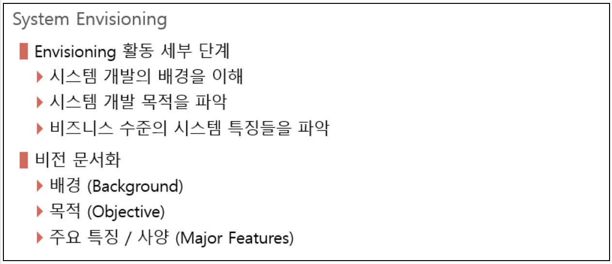
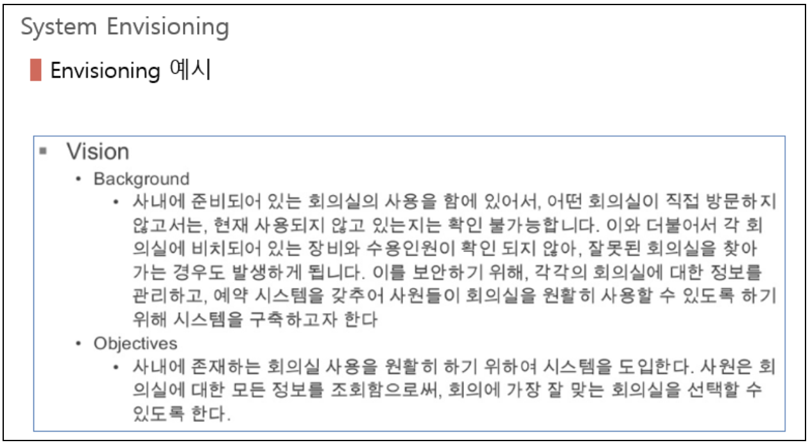

# 요구사항 분석

## 요구사항이란?

- 문제의 해결 혹은 목적 달성을 위하여 요구되는 시스템이 가져야 할 서비스 또는 제약사항
- 고객이 요구한 사항과 요구하지 않았더라도 당연히 제공되어야 한다고 가정되는 사항들
- 요구사항이 전체 시스템 가이드 역할

요구사항 분석 양식 파일  
[요구사항분석.xlsx](../file/요구사항분석.xlsx)

