# Activity Diagram

## 행위 다이어그림

- 동작을 나타내는 다이어그램
- 각 요소들 혹은 요소들간의 변화나 흐름, 주고받는 데이터 등을 표현
- 종류
  - 시퀀스 다이어그램
  - 통신 다이어그램
  - 상태 다이어그램
  - 액티비티 다이어그램

### 시퀀스 다이어그램(시간에 따라 변하는 동적 다이어그램)

시퀀스 다이어드램은 시스템객체들 간 어떤 메시지들이 보내지는지, 그리고 어떤 순서로 발생하는지를 나타낸다. 다이어그램은 이 정보를 수직적 측면과 수평적 측면으로 전달한다. **수직 측면에서는 위에서 밑으로 진행하는 방식으로 메시지/호출이 발생하는 시간 순서를 나타내고, 수평 측에서는 왼쪽에서 오른쪽으로 메시지가 보내진 객체 인스턴스를 보여준다.**

- 객체란?  
  객체는 시퀀스 다이어그램의 가장 윗부분에 위치하며, 왼쪽에서 오른쪽으로 배치된다. 각 객체로 부터 아래로 뻗어가는 쇄선은 객체의 생명선이니다. 좁은 사각형은 실행이라고 하고 객체가 수행하는 오퍼레이션이 실행되고 있음을 나타냅니다.
- 메시지란?  
  한 객체에서 다른 객체로 전송되는 메시지는 한 객체의 생명선에서 다른 객체의 생명선으로 이동하는 것을 의미합니다. 자기 자신에게도 메시지를 보낼수 있다.

> 클래스다이어그램은 정적이기 때문에 각각의 클래스간의 관계는 알수 있지만 어떤 메소드가 어떤순서로 어떻게 실행되는지 알 수 없다. 반면에 시퀀스다이어그램은 한 객체에서 다른 객체로 전달되는 메시지를 보여줌으로써 동적인 뷰를 제공한다.

#### 시퀀스 다이어그램 예시

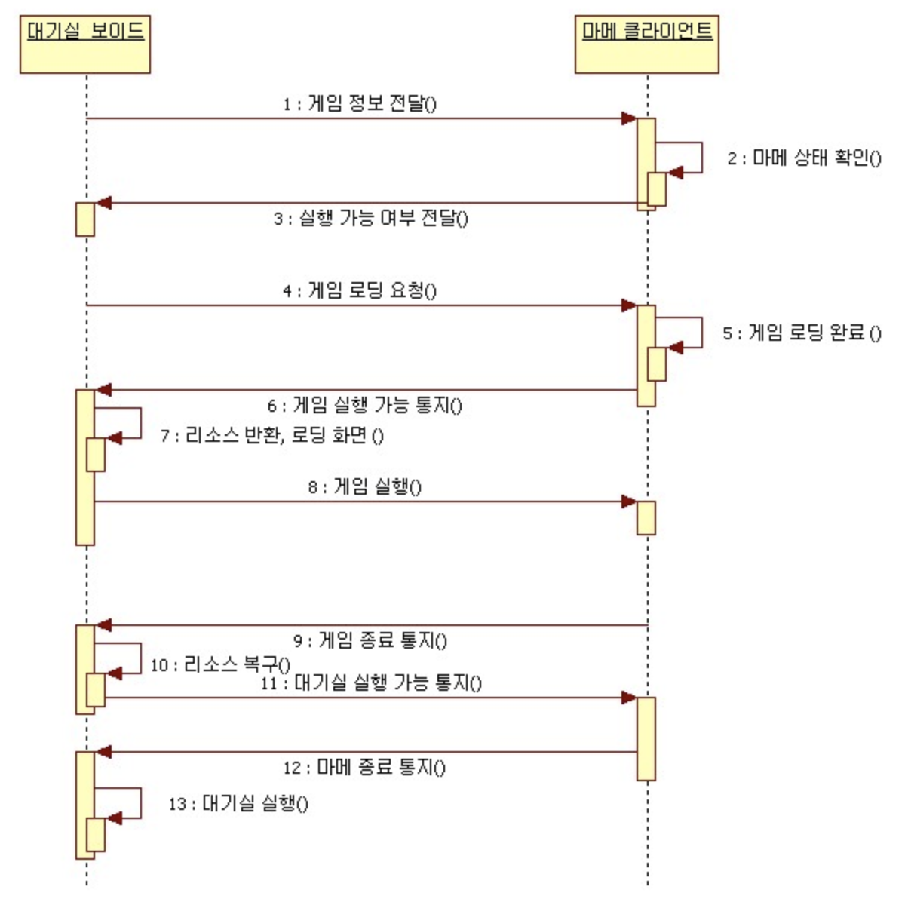

### 통신 다이어그램

<https://blog.naver.com/infopub/100068218619>

### 상태 다이어그램

<https://blog.naver.com/jwyoon25/221526186609>

### 액티비티 다이어그램

<https://blog.naver.com/umeo111/221164749223>

- 비지니스 워크 플로우를 표현
- 유스케이스를 구성하는 활동의 상세한 흐름을 표현
- 업무 처리 과정을 나타내거나 분석할 때 유용

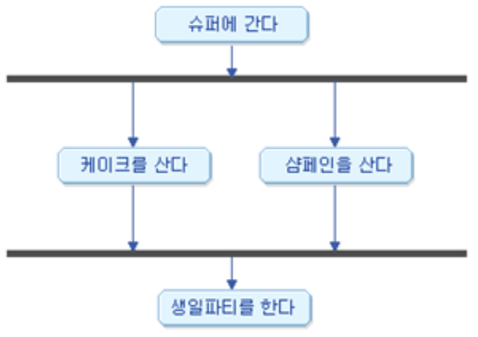

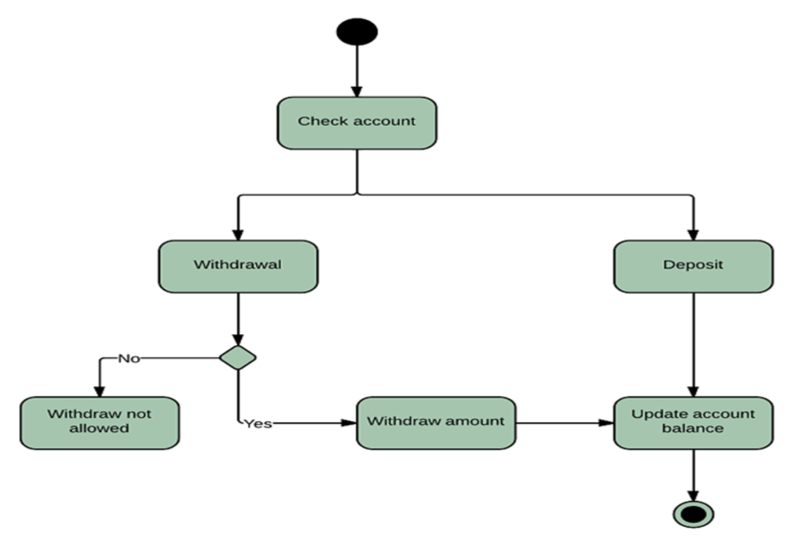

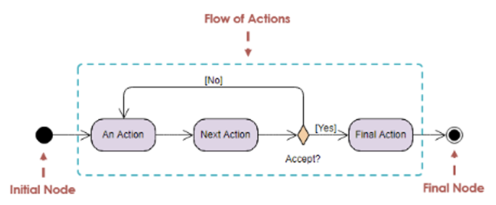

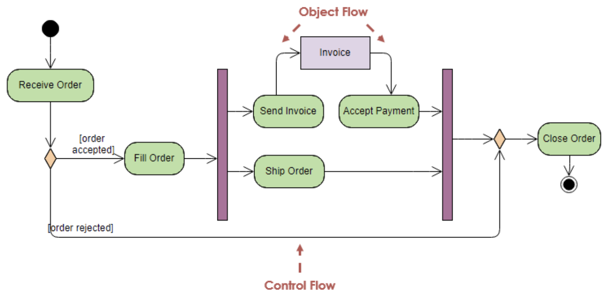

#### Swimlane 적용

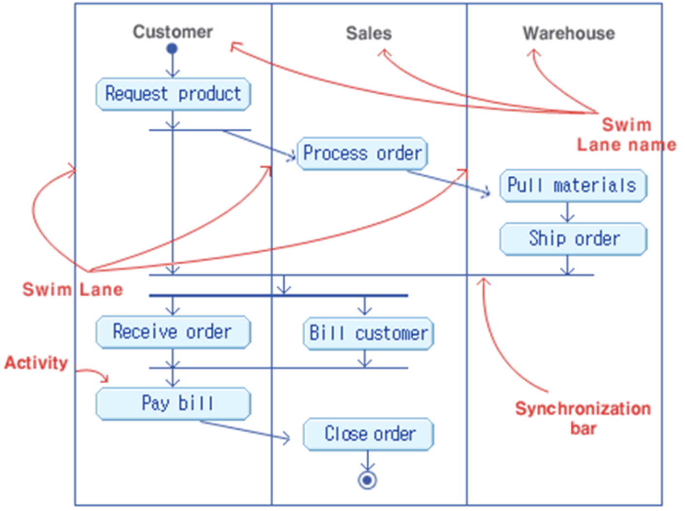

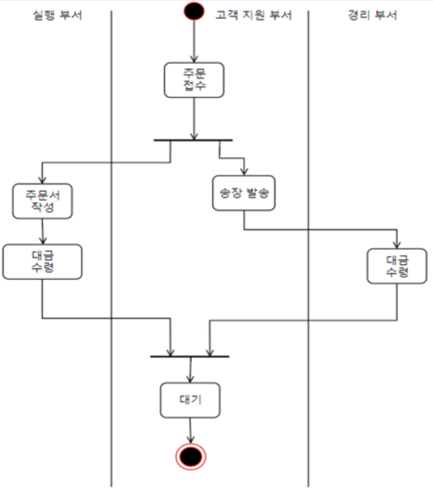

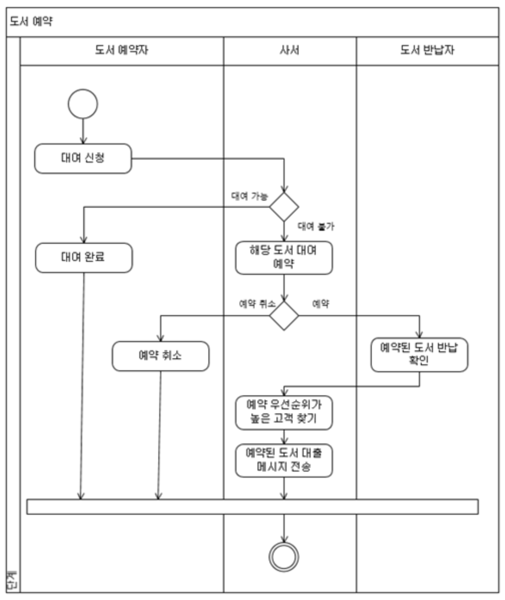

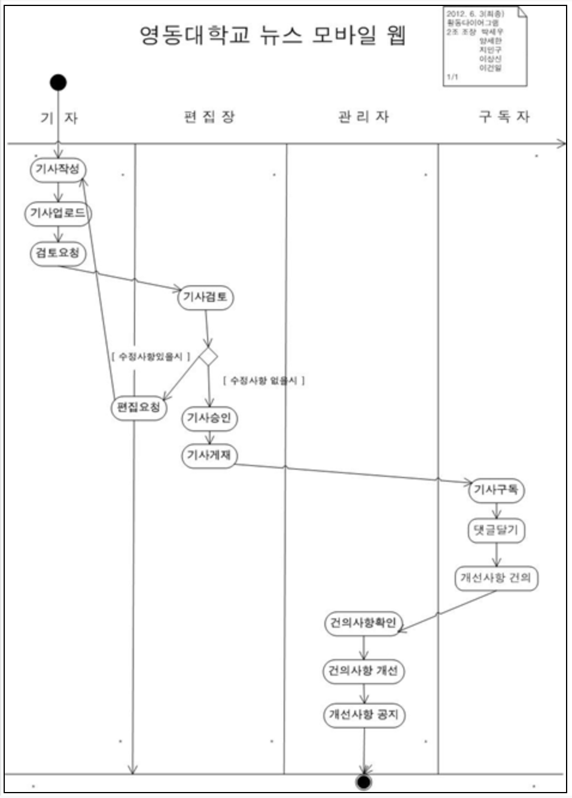

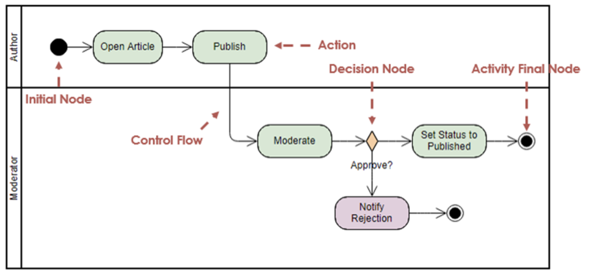

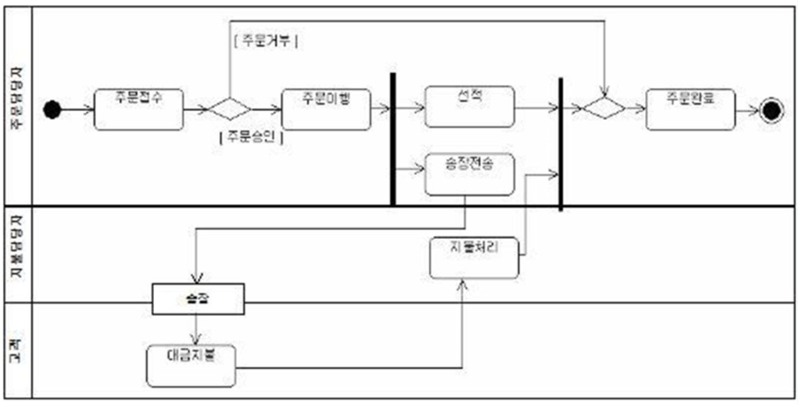
